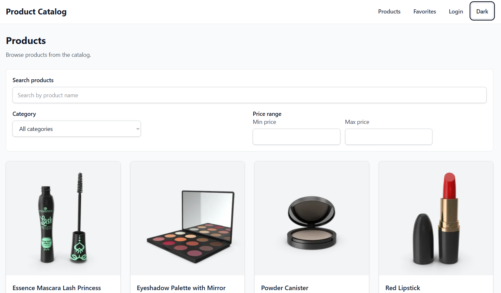
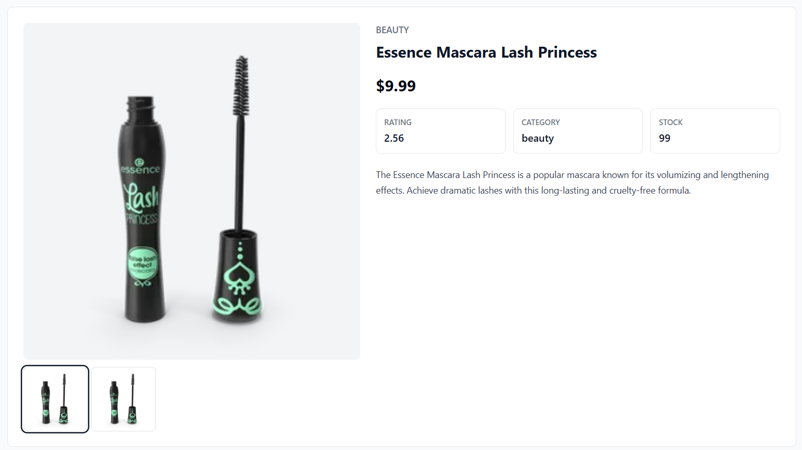
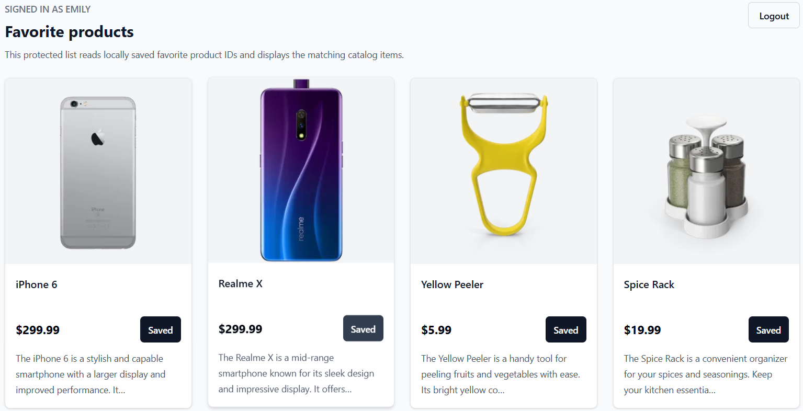
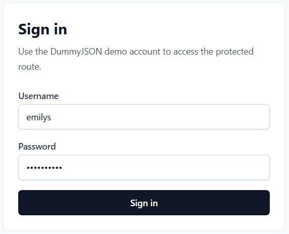
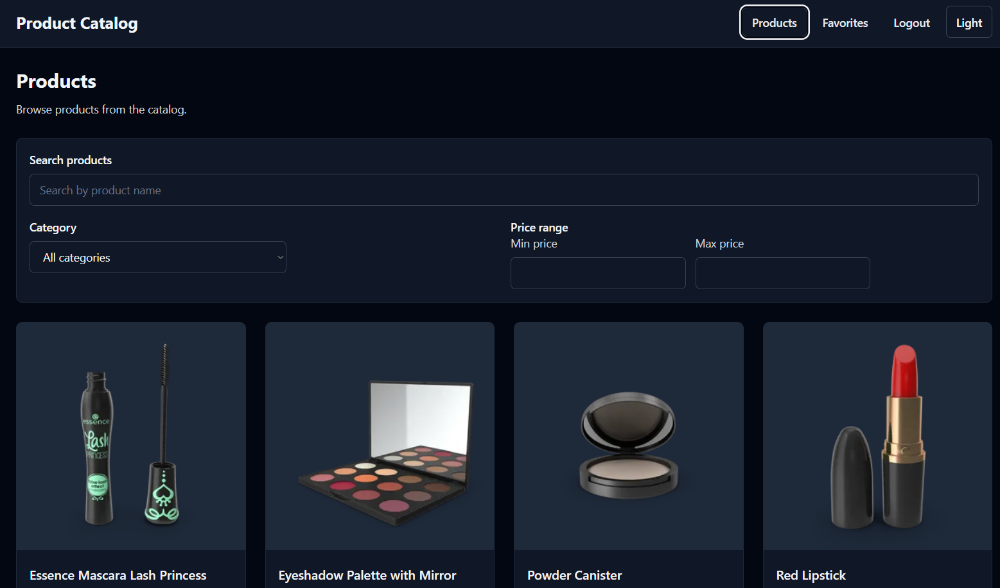

# Product Catalog SPA

A responsive React product catalog app built with DummyJSON. It supports browsing products, searching and filtering, product details, authentication, protected favorites, dark mode, and automated tests.

## Features

- Product catalog with image, title, price, short description, and pagination.
- Search with debounce.
- Category and price range filters synced with the URL.
- Product detail page with image gallery, rating, category, stock, and description.
- Back navigation that preserves list state.
- Loading, empty, error, retry, and skeleton states.
- Dark mode with saved preference.
- DummyJSON login.
- Protected favorites page.
- Favorite buttons on product cards.
- Responsive layout for mobile, tablet, and desktop.


*Main site*









## Tech

- React 19
- TypeScript 6
- Vite 8
- React Router 6
- TanStack Query 5
- Tailwind CSS 4
- Vitest
- React Testing Library
- MSW
- ESLint

## File Structure

```text
src/
  app/
    App.tsx
    router.tsx
    providers.tsx
    NotFoundPage.tsx
  features/
    auth/
    favorites/
    products/
  shared/
    components/
    hooks/
    lib/
    types/
    utils/
  test/
    mocks/
    setup.ts
    testUtils.tsx
```

## Commands

Install dependencies:

```bash
npm install
```

Create a local environment file:

```bash
cp .env.example .env
```

Run the development server:

```bash
npm run dev
```

Run tests:

```bash
npm run test
```

Run TypeScript checks:

```bash
npm run typecheck
```

Run lint:

```bash
npm run lint
```

Build for production:

```bash
npm run build
```

Preview the production build:

```bash
npm run preview
```

Environment variables used by the app:

```env
VITE_API_BASE_URL=https://dummyjson.com
VITE_DEFAULT_PAGE_SIZE=24
VITE_ENABLE_DEVTOOLS=false
```

Demo login credentials:

```text
username: emilys
password: emilyspass
```

## AI Usage

AI tools were used during planning, implementation, testing, and documentation.

- Planning: helped break the assignment into specs, acceptance criteria, and an implementation roadmap.
- Implementation: helped draft React, TypeScript, routing, filtering, authentication, favorites, dark mode, and loading-state changes.
- Testing: helped create and update Vitest and React Testing Library coverage.
- Documentation: helped organize this README.

All AI-assisted output was reviewed, edited, and verified.


AI prompt for planing:
```
You are acting as a senior frontend architect, technical analyst, and implementation-planning agent.
Your job is to deeply analyze the uploaded PDF assignment frontend-dev.pdf, research current best practices, and generate a complete implementation-planning system for another coding agent.
The uploaded PDF is the primary source of truth. You MUST read and inspect the entire PDF thoroughly before writing any output. Do not rely only on the visible summary or filename. Extract every functional requirement, technical requirement, bonus requirement, delivery requirement, API endpoint, and evaluation criterion from the PDF.
After reading the PDF, you MUST search the web for current best practices and documentation related to the required stack and project type. This web research is mandatory. Also use Context7 for up-to-date documentation and examples for the relevant libraries and tools. use context7

Research at minimum:
- React 18+ current best practices
- TypeScript 5.x strict-mode patterns
- Vite React project setup
- React Router 6+ routing and URL query params
- TanStack Query, especially caching, request deduplication, pagination/infinite queries
- Vitest and React Testing Library
- Tailwind CSS or another consistent styling approach
- DummyJSON API documentation, especially products, categories, search, product details, and auth
- Accessibility/WCAG basics for React apps
- SPA deployment on Vercel or Netlify
- Dockerfile for building and serving a Vite SPA
- Recommended frontend project folder structures

Important:
- Do not invent requirements that contradict the PDF.
- If you add assumptions or recommended enhancements, clearly mark them as “Recommended” or “Assumption”.
- The PDF requirements always win over general web advice.
- When you use web or Context7 information, summarize the concept and record which docs/sources influenced the decision.
- The final output must be a planning/documentation package, not application code.

Your final task is to create the following files and folders:
specs/
  general/
    project-overview.md
    functional-requirements.md
    user-flows.md
    acceptance-criteria.md
    delivery-requirements.md
    ai-usage-notes.md
  tech/
    tech-stack.md
    architecture.md
    file-structure.md
    api-integration.md
    routing-and-url-state.md
    state-management-and-caching.md
    styling-and-responsive-design.md
    accessibility.md
    testing-strategy.md
    environment-and-setup.md
    deployment.md
    docker.md

You may create additional spec files if they are useful, but do not skip any file listed above.
```